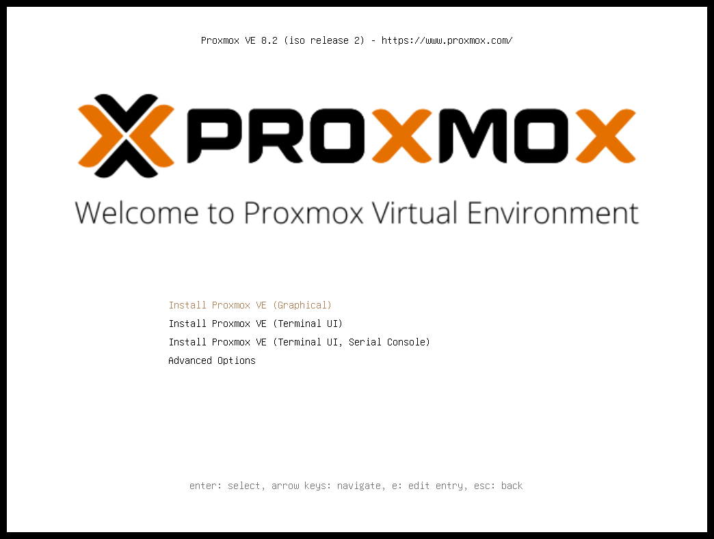
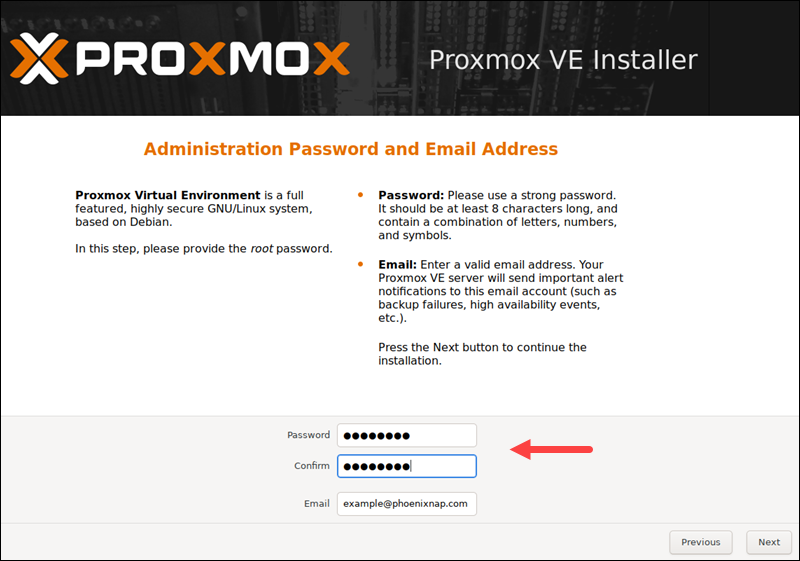
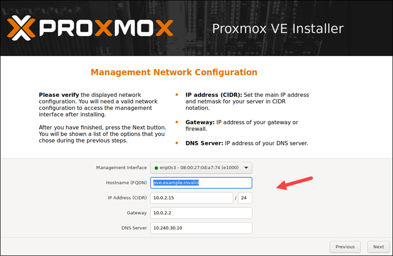
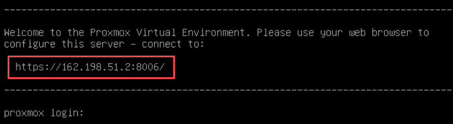
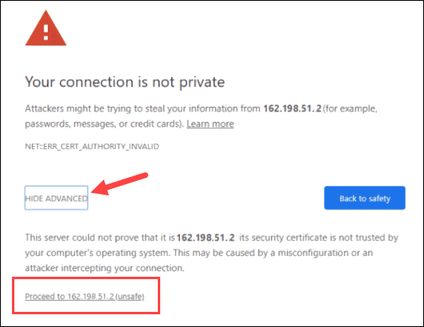
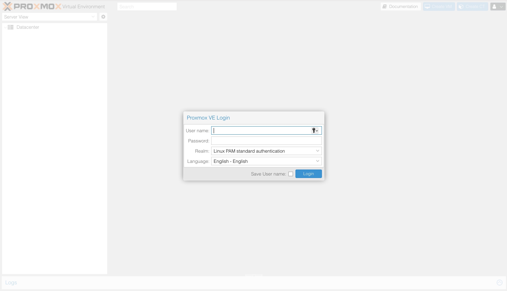
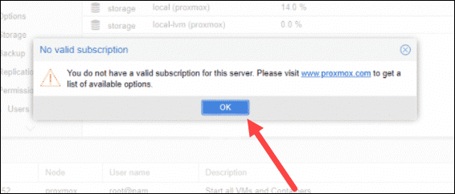
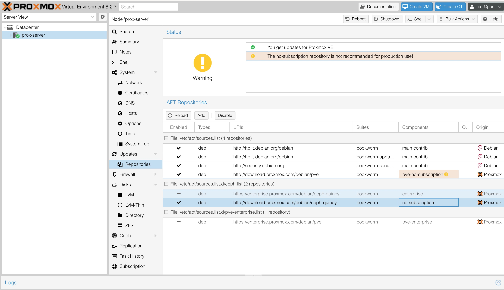
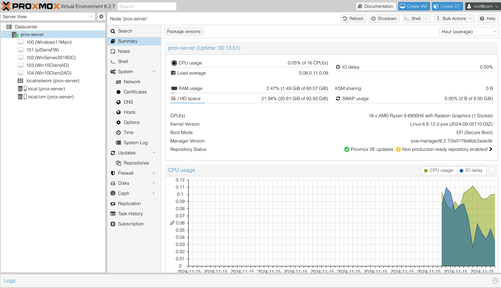

In questa sezione andremo a vedere tutti i passaggi per configurare il nostro mini server Minis FORUM UM690s con Proxmon VE 

**Proxmox VE (Virtual Environment)** è una piattaforma open-source per la virtualizzazione, progettata per gestire macchine virtuali (VM) e container in un ambiente centralizzato. È particolarmente utilizzata in ambiti aziendali e professionali grazie alla sua combinazione di potenza, flessibilità e semplicità.

## Prerequisiti 

- Un server (nel nostro caso abbiamo un MINIS FORUM UM690s AMD Ryzen 9 6900HX, 64 GB di RAM e 1 TB di storage.)
- Una chiavetta usb (minimo 4GB)
- Rufus.exe : è un software gratuito e open-source utilizzato per creare dischi di avvio (bootable) da dispositivi come USB o dischi esterni.
- File iso di ProxmonVE [Scaricabile qui ](https://www.youtube.com/redirect?event=video_description&redir_token=QUFFLUhqbTRsUTdtQVJKQzM4UGxFcFBsajY2a0g0NHhQd3xBQ3Jtc0trS0JqakI2WlliZEZCU2hsTVNtby1hWjRzcF95aGx6cG5DTFB3R0JRZ0JxdG5INW9wSzJ5WFFab3h2OGVNX1ZpTEN1bFo1a1llanA4NC1kLUk3aHNpYnBiN3laTHl5VTh0U29TQ0k4eUcxU1RGb3ozSQ&q=https%3A%2F%2Fwww.proxmox.com%2Fen%2Fdownloads%2Fproxmox-virtual-environment%2Fiso&v=6YZXI1uBF6I)

## Creazione della USB bootabile

- **Scarica e avvia Rufus**: Scarichiamo Rufus.exe dal sito ufficiale e avvialo (non richiede installazione).

- **Seleziona la tua USB**: Collega la tua pen drive USB al computer. In Rufus, seleziona l'unità USB dal menu a tendina sotto "Dispositivo".

- **Seleziona l'immagine ISO di Proxmox VE**: Clicca sul pulsante "SELEZIONA" accanto a "Selezione ISO". Scegli il file ISO di Proxmox VE che hai già scaricato.

- **Imposta le opzioni di avvio**: Scegli **GPT** come schema di partizione per sistemi UEFI o **MBR** per BIOS legacy, a seconda del tuo hardware. Lascia **FAT32** come file system. Puoi mantenere le altre impostazioni predefinite.

- **Avvia la creazione**: Clicca su **Start** per iniziare. Rufus ti avviserà che tutti i dati sulla USB verranno cancellati. Conferma per proseguire.

- **Attendi il completamento**: Il processo richiederà pochi minuti. Quando è finito, avrai una USB avviabile con Proxmox VE pronta per l'installazione.

Una volta completato, siamo pronti per utilizzare la nostra USB per avviare e installare Proxmox VE sul server.

## Installazione ProxmonVE 

- Prima di accendere il server inseriamo la chiavetta USB.
- Accendiamo ed entrando nel bios, gli diciamo di caricare il sistema della chiavetta USB, usciamo e salviamo.
- Un volta partito ci troviamo davanti a questa schermata

 

- Selezioniamo "Install ProxmonVE (Grraphical)"  
- Seguiamo la procedura guidata.

- Nella sezione di scelta della password teniamola bene a mente perché sarà quella che ci consentirà di accedere all'interfaccia web di proxmon una volta completata l'operazione.

- **Nella sezione Managment Network Configuration** scegliamo un hostname ( es: prox-server.local) un IP (192.168.1.7) la subnet la lasciamo /24  gli altri parametri verrano forniti direttamene dal router a cui è collegato il server (gateway 192.168.1.1 DNS 192.168.1.1 )

- per tutto il resto lasciamo di default.

Una volta riavviato ci troveremo davanti al prompt di login dove abbiamo l'indirizzo scelto in fase d'istallazione per collegarci all'interfaccia web.

>[!warning] Dopo aver raggiunto l'indirizzo IP richiesto, potresti visualizzare un messaggio di avviso che informa che la pagina non è sicura perché Proxmox VE utilizza certificati SSL autofirmati. Facciamo  clic sul collegamento IP per procedere all'interfaccia di gestione web di Proxmox

Per accedere all'interfaccia, accedi come root e fornisci la password che hai impostato durante l'installazione di Proxmox.

Viene visualizzata una finestra di dialogo che informa che non esiste un abbonamento enterprise valido per il server. Proxmox offre un servizio aggiuntivo opzionale al quale è possibile abbonarsi. Per ignorare il messaggio, fare clic su OK.

Il repository **Proxmox VE "No Subscription"** è un'opzione alternativa a quello **Enterprise**, ed è utilizzato per ottenere aggiornamenti gratuiti e non supportati ufficialmente. Questo repository fornisce pacchetti software più aggiornati, ma non include il supporto commerciale e può contenere software meno testato rispetto alla versione Enterprise. Per utilizzare questo repository, basta modificare il file di configurazione del sistema per puntare al server "no-subscription" invece di quello Enterprise. Questo consente di mantenere il sistema aggiornato senza necessitare di un abbonamento.

Questa è il pannello di controllo di Proxmon VE da qui gestiremo tutto il nostro lab ,come si deve io ho gia tutte le VM configurate. 

Nelle prossime sezioni andremo a vedere come creare le varie VM a partire dal pfSense, che sarà il nostro firewall e gestirà la segmentazione della rete , fino alla configurazione dell'ambiente Active Directory con il nostro DC ed i vari client.

